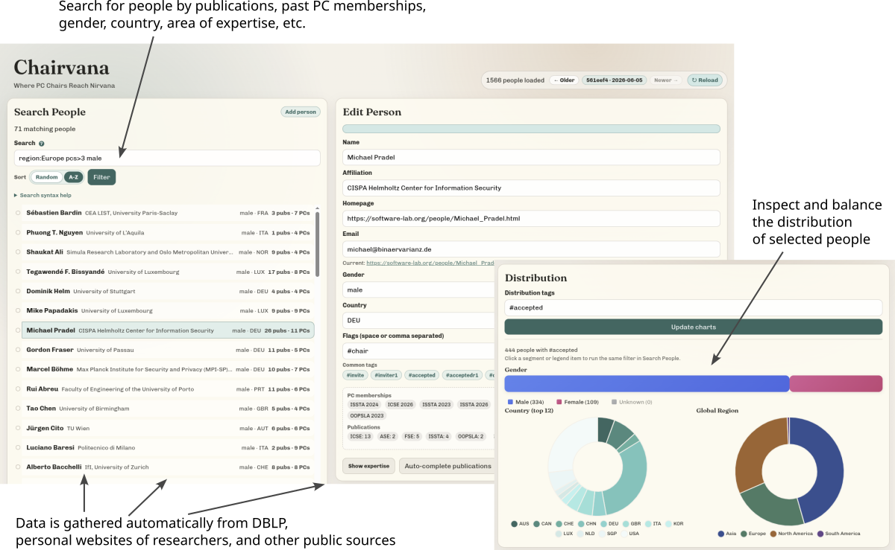

# Chairvana: Where PC Chairs Reach Nirvana

Chairvana supports program committee chairs of academic conferences. It offers support for finding PC members and managing their information and areas of expertise.



## Installation

1. Clone this repository and enter the main directory:
	```
	git clone https://github.com/michaelpradel/Chairvana.git
	cd Chairvana
	```
2. Install dependencies:
	```
	pip install -r requirements.txt
	```

3. Optionally, to use LLM-based features, such as auto-completing information (e.g., email, personal website, gender or potential PC members) and features based on semantic embeddings of expertise (e.g., to find reseachers with specific expertise), add an OpenAI API key into file `.openai_token`.

## Setting Up the Data Repository

The heart of Chairvana is a data repository, which contains information about researchers, such as their name, affiliation, email, personal website, and areas of expertise, as well as information about papers. The data store is implemented as a Git repository in `data/people_store`.
As you'll store potentially sensitive information about researchers (e.g., who to invite to the PC), we recommend using a private repository, either locally or on a hosting service such as GitHub.

### Create a Git repository for the data store

To create a local repository, run:

```
mkdir -p data/people_store
cd data/people_store
git init
cd ../..
```

To use a remote repository, create a new private repository on GitHub and clone it into `data/people_store`:

```
git clone <remote-repo-url> data/people_store
```

### Option 1: Starting from an Existing Data Repository

The easiest option for filling the data store to start from an existing data repository, such as [this software engineering-focused data store that was created for gathering the FSE'27 PC](https://github.com/michaelpradel/Chairvana-data-SE).
To use it, clone the repository and copy its contents into your `data/people_store` directory:

```
git clone https://github.com/michaelpradel/Chairvana-data-SE.git /tmp/people_store
cp -r /tmp/people_store/*.jsonl data/people_store/
```

### Option 2: Creating the People Store from Scratch

Alternatively, you can create a new data store from scratch. This is recommended for using Chairvana in a different research community or to ensure that all data is freshly collected from the web.
To fill the data store with information about researchers, use the web UI or command-line tools, as described below.

## Web UI

The web UI is meant for searching for researchers, tagging them (e.g., with #invite), and making manual edits to their information. To use it:

1. Start the UI:
	```bash
	python src/web/web_ui.py
	```

2. Open http://127.0.0.1:5000 in your browser.

## Command-Line Tools

The command-line tools are meant for batch operations, such as integrating external data (e.g., from DBLP), automatically completing missing information via a web-search-enabled LLM (e.g., email, gender), and exporting data (e.g., to a CSV file to import into HotCRP).

### Finding Members of Past PCs

`python src/cli/find_past_pc_members.py` uses a web-search-enabled LLM to find members of past PCs for a given conference and year range. This is useful for seeding the data store with initial information about researchers in the target community.

### Integrating DBLP Data

Integrating DBLP data is a two-step process: preprocess first, then sync publication summaries into the people store.

`python src/util/query_dblp.py --preprocess` preprocesses DBLP into `data/people_store/dblp_filtered.jsonl`, containing only:

- publication types: `inproceedings`, `article`
- venues (by DBLP key prefix): `conf/icse`, `conf/sigsoft`, `conf/kbse`, `conf/issta`, `conf/oopsla`

`python src/cli/sync_people_with_publications.py` updates `publication_summary` for existing people and adds new people with at least `--min-publications` target-venue papers in the selected year window.

### Auto-Completing Missing Information

`python src/cli/auto_complete.py` (web-search-enabled LLM) runs a multi-stage enrichment pipeline to fill missing country, email, homepage, and affiliation fields.

`python src/cli/find_gender.py` (LLM + web-search-enabled LLM) infers and stores gender using a two-tier approach (name-based first, then homepage-based when needed).

`python src/cli/auto_clean_and_dedup.py` (LLM) batch-cleans names/affiliations/countries and then merges likely duplicate people records.

### Expertise Embeddings

`python src/cli/expertise_embeddings.py` computes expertise embeddings for all researchers in the data store, based on their publication titles and abstracts. The embeddings are stored in `data/people_store/expertise_embeddings.jsonl` and can be used for finding researchers with specific expertise via semantic search.

### Exporting, Emailing, and Importing

`python src/cli/export_to_csv.py --tag invite --output invite_people.csv` exports people with the given tag from `data/people_store/people.jsonl` to CSV.

`python src/cli/email.py --tag inviter1` sends templated emails to people with the given tag, previews random samples, asks for confirmation, and writes logs to `logs/`.

`python src/cli/import_pc_invitation_responses.py r1_responses.csv inviter1` imports invitation responses, matches people by email/name, updates tags (Yes/No), and fills changed email addresses from the response file.


